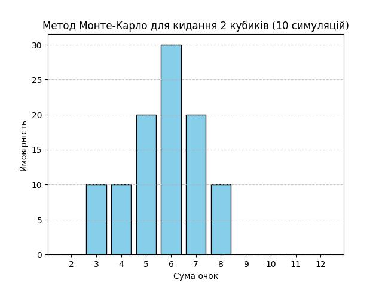
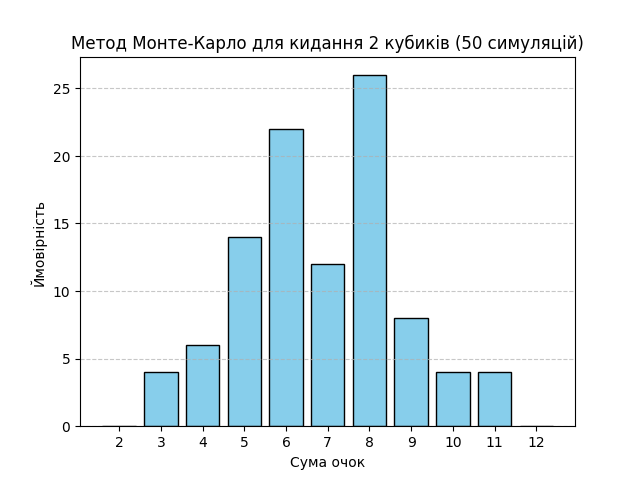
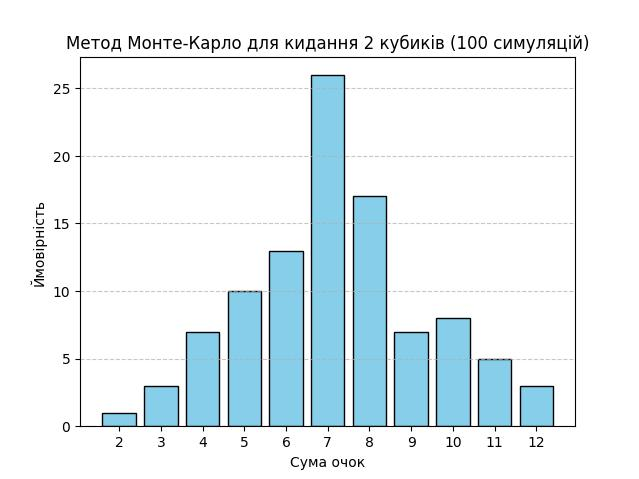
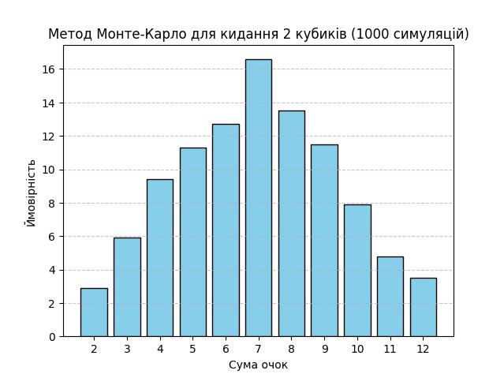
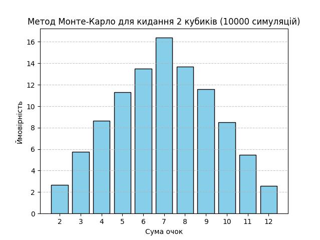

# goit-algo-fp

Завдання_7 Висновок
При проведенні симуляцій за допомогою програми, яка моделює метод Монте Карло для отримання ймовірностей кидків кубика було виявлено, що при малих кількостях симуляцій (10 - 50)

отримані результати мали істотні відмінності.

При  збільшенні кількості симуляцій

результати мали наближенне значення до даних отримано аналітично.

Коли кількість симуляцій збільнили до однієї тисячі та більше

отримані результати наближаються до даних які ми отрмуємо із таблиці,
звідки можна зробити висновок, що більша кількість експериментів зазвичай призводить до більш точних результатів, але також збільшує обчислювальні витрати.
Також варто зазначити, що метод не завжди забезпечує абсолютну точність, але може бути корисним для швидкого отримання орієнтовних результатів.
